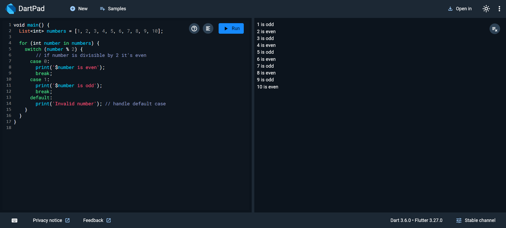

## Programing by Dart - Control Flow - Categorize a list of numbers into even or odd

**Task General Description**

Categorize a list of numbers into even or odd using for loop and switch case

**Requirement 1**

**Title:** Categorize a list of numbers into even or odd  
**Description:** Add a list of numbers  
Iterate each number in the list using for for-loop  
Use the switch case to check if it is even or odd

    void main() {
      List<int> numbers = [1, 2, 3, 4, 5, 6, 7, 8, 9, 10];
    
      for (int number in numbers) {
        switch (number % 2) {
          // if number is divisible by 2 it's even
          case 0:
            print('$number is even');
            break;
          case 1:
            print('$number is odd');
            break;
          default:
            print('Invalid number'); // handle default case
        }
      }
    }

**Screenshots of output**
